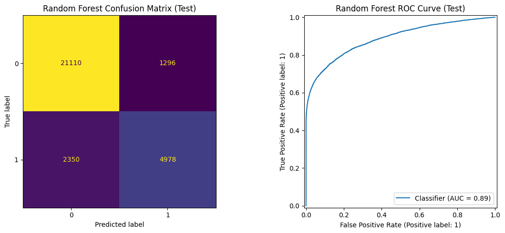

# Loan Default Risk Analysis

An end-to-end machine learning project using 148,670 mortgage application records to study binary loan outcomes. The project covers exploratory analysis, leakage prevention, reproducible preprocessing, supervised model comparison, stability testing, and unsupervised borrower segmentation.

## Key results

| Model | Accuracy | Precision | Recall | F1 score | Area under the ROC curve |
|---|---:|---:|---:|---:|---:|
| Logistic regression | 0.8314 | 0.6602 | 0.6507 | 0.6554 | 0.8425 |
| Random forest | **0.8774** | **0.7934** | **0.6793** | **0.7320** | **0.8872** |
| Strict logistic regression | 0.7058 | 0.4347 | 0.6447 | 0.5193 | 0.7475 |
| Strict random forest | 0.8733 | 0.7748 | **0.6853** | 0.7273 | 0.8856 |

The random forest produced the strongest held-out performance. Across five training folds, its mean area under the receiver operating characteristic curve was 0.8823 ± 0.0029; across ten repeated splits it was 0.8829 ± 0.0025.



## Important limitation

This is an educational analysis, not a deployable lending system. Three post-outcome columns were removed because their missingness nearly revealed the target. In addition, `credit_type = EQUI` occurs with `Status = 1` in 15,297 of 15,298 records. That may be a real signal, a data-collection artifact, or another target proxy. A stricter sensitivity run removes this field: the forest's area under the curve changes only from 0.8872 to 0.8856, while logistic regression falls from 0.8425 to 0.7475. The forest is therefore robust to this single exclusion, but all feature timing still needs verification.

See [Methodology](docs/METHODOLOGY.md) for the full reasoning, equations, leakage audit, and interpretation.

## Repository structure

```text
loan-default-risk-analysis/
├── data/
│   ├── README.md
│   └── loan_default.csv
├── docs/
│   └── METHODOLOGY.md
├── notebooks/
│   └── loan_default_analysis.ipynb
├── reports/
│   ├── figures/
│   ├── model_metrics.csv
│   └── strict_model_metrics.json
├── src/
│   └── train.py
├── .gitignore
├── LICENSE
├── README.md
└── requirements.txt
```

## Run locally

```bash
git clone https://github.com/YOUR-USERNAME/loan-default-risk-analysis.git
cd loan-default-risk-analysis
python3 -m venv .venv
source .venv/bin/activate
pip install -r requirements.txt
jupyter lab notebooks/loan_default_analysis.ipynb
```

Run the reusable training script with the stricter feature set:

```bash
python src/train.py --strict
```

Remove `--strict` to reproduce the notebook's original feature set.

## Main findings

- The positive class represents 24.64% of the data, so stratification and class balancing are important.
- Higher loan-to-value and debt-to-income ratios are associated with a higher positive-outcome rate.
- The random forest improves all held-out metrics over logistic regression, suggesting useful nonlinearities and interactions.
- K-means selects two broad borrower groups. The lower-income, lower-property-value group has a 27.40% positive-outcome rate versus 17.92% for the higher-value group.
- Stable results across repeated splits reduce concern about a lucky train-test partition, but do not solve proxy leakage or external-validity concerns.

## Responsible use

Financial models can reproduce historical bias. Before real use, verify feature timing, audit performance across protected groups, calibrate predicted probabilities, define the cost of false positives and false negatives, and validate on newer data from a different institution or time period.

## Data source

The included data is the public `Loan_Default.csv` used by the original notebook. Its upstream provenance and license should be independently verified before redistribution or commercial use. Details are in [data/README.md](data/README.md).

## Author

Darren Chailand
